# 要件定義書（RDD: Requirements Definition Document）

## 1. プロジェクト概要
本プロジェクトは、データレイクハウスアーキテクチャを基盤としたデータ分析・機械学習基盤の構築を目的とします。各種OSSを活用し、データの収集から分析・可視化、機械学習モデルの運用までを一気通貫で実現します。

## 1.1 システム構成図

## 1.2 データフロー

```mermaid
graph TB
    %% 外部データソース
    API[Stock Price API<br/>Yahoo Finance/Alpha Vantage]
    NEWS[News API<br/>経済ニュース]
    MARKET[Market Data<br/>指数・為替データ]

    %% Airflow Jobs - Data Ingestion
    EXTRACT[Airflow Job:<br/>extract_stock_data<br/>🔄 Daily 6:00 AM]
    EXTRACT_NEWS[Airflow Job:<br/>extract_news_data<br/>🔄 Every 4 hours]
    EXTRACT_MARKET[Airflow Job:<br/>extract_market_data<br/>🔄 Daily 6:30 AM]

    %% Bronze Layer (Raw Data)
    BRONZE_STOCK[(Bronze Layer<br/>stock_prices_raw<br/>Delta Lake + MinIO)]
    BRONZE_NEWS[(Bronze Layer<br/>news_raw<br/>Delta Lake + MinIO)]
    BRONZE_MARKET[(Bronze Layer<br/>market_data_raw<br/>Delta Lake + MinIO)]

    %% Airflow Jobs - Data Cleansing
    CLEAN_STOCK[Airflow Job:<br/>clean_stock_data<br/>Apache Spark + Deequ]
    CLEAN_NEWS[Airflow Job:<br/>clean_news_data<br/>Apache Spark]
    CLEAN_MARKET[Airflow Job:<br/>clean_market_data<br/>Apache Spark]

    %% Silver Layer (Cleaned Data)
    SILVER_STOCK[(Silver Layer<br/>stock_prices_clean<br/>Delta Lake + MinIO)]
    SILVER_NEWS[(Silver Layer<br/>news_clean<br/>Delta Lake + MinIO)]
    SILVER_MARKET[(Silver Layer<br/>market_data_clean<br/>Delta Lake + MinIO)]

    %% Data Quality Checks
    QUALITY[Airflow Job:<br/>data_quality_check<br/>Deequ Validation]

    %% Airflow Jobs - Feature Engineering
    TECH_FEATURES[Airflow Job:<br/>create_technical_features<br/>SMA, RSI, Bollinger Bands]
    SENTIMENT[Airflow Job:<br/>sentiment_analysis<br/>News Sentiment Scoring]
    MACRO_FEATURES[Airflow Job:<br/>create_macro_features<br/>Market Correlation Features]

    %% Gold Layer (Analytics Ready)
    GOLD_STOCK[(Gold Layer<br/>stock_features<br/>Delta Lake + MinIO)]
    GOLD_SENTIMENT[(Gold Layer<br/>sentiment_features<br/>Delta Lake + MinIO)]
    GOLD_MACRO[(Gold Layer<br/>macro_features<br/>Delta Lake + MinIO)]

    %% Feature Store
    FEATURE_STORE[(Feature Store<br/>unified_features<br/>Delta Lake + MinIO)]

    %% Airflow Jobs - ML Pipeline
    FEATURE_UNION[Airflow Job:<br/>unite_features<br/>Feature Engineering]
    TRAIN_MODEL[Airflow Job:<br/>train_ml_models<br/>Spark MLlib + MLflow]
    BACKTEST[Airflow Job:<br/>backtest_strategies<br/>Strategy Validation]
    DEPLOY_MODEL[Airflow Job:<br/>deploy_model<br/>Model Deployment]

    %% ML Artifacts
    MODEL_REGISTRY[(MLflow Model Registry<br/>Trained Models)]
    PREDICTIONS[(Predictions Table<br/>Delta Lake + MinIO)]

    %% BI & Analytics
    SUPERSET[Apache Superset<br/>📊 BI Dashboard]
    ALERTS[Airflow Job:<br/>generate_alerts<br/>Trading Signals]

    %% Monitoring
    MONITOR[Airflow Job:<br/>model_monitoring<br/>Performance Tracking]

    %% Data Flow Connections
    API --> EXTRACT
    NEWS --> EXTRACT_NEWS
    MARKET --> EXTRACT_MARKET

    EXTRACT --> BRONZE_STOCK
    EXTRACT_NEWS --> BRONZE_NEWS
    EXTRACT_MARKET --> BRONZE_MARKET

    BRONZE_STOCK --> CLEAN_STOCK
    BRONZE_NEWS --> CLEAN_NEWS
    BRONZE_MARKET --> CLEAN_MARKET

    CLEAN_STOCK --> SILVER_STOCK
    CLEAN_NEWS --> SILVER_NEWS
    CLEAN_MARKET --> SILVER_MARKET

    SILVER_STOCK --> QUALITY
    SILVER_NEWS --> QUALITY
    SILVER_MARKET --> QUALITY

    QUALITY --> TECH_FEATURES
    QUALITY --> SENTIMENT
    QUALITY --> MACRO_FEATURES

    SILVER_STOCK --> TECH_FEATURES
    SILVER_NEWS --> SENTIMENT
    SILVER_MARKET --> MACRO_FEATURES

    TECH_FEATURES --> GOLD_STOCK
    SENTIMENT --> GOLD_SENTIMENT
    MACRO_FEATURES --> GOLD_MACRO

    GOLD_STOCK --> FEATURE_UNION
    GOLD_SENTIMENT --> FEATURE_UNION
    GOLD_MACRO --> FEATURE_UNION

    FEATURE_UNION --> FEATURE_STORE
    FEATURE_STORE --> TRAIN_MODEL
    TRAIN_MODEL --> MODEL_REGISTRY
    TRAIN_MODEL --> BACKTEST

    BACKTEST --> DEPLOY_MODEL
    DEPLOY_MODEL --> PREDICTIONS

    PREDICTIONS --> SUPERSET
    FEATURE_STORE --> SUPERSET
    GOLD_STOCK --> SUPERSET
    GOLD_SENTIMENT --> SUPERSET

    PREDICTIONS --> ALERTS
    MODEL_REGISTRY --> MONITOR
    PREDICTIONS --> MONITOR

    %% Styling
    classDef airflowJob fill:#1f77b4,stroke:#333,stroke-width:2px,color:#fff
    classDef bronzeLayer fill:#cd853f,stroke:#333,stroke-width:2px,color:#fff
    classDef silverLayer fill:#c0c0c0,stroke:#333,stroke-width:2px,color:#000
    classDef goldLayer fill:#ffd700,stroke:#333,stroke-width:2px,color:#000
    classDef externalAPI fill:#ff7f0e,stroke:#333,stroke-width:2px,color:#fff
    classDef analytics fill:#2ca02c,stroke:#333,stroke-width:2px,color:#fff
    classDef mlComponent fill:#9467bd,stroke:#333,stroke-width:2px,color:#fff

    class EXTRACT,EXTRACT_NEWS,EXTRACT_MARKET,CLEAN_STOCK,CLEAN_NEWS,CLEAN_MARKET,QUALITY,TECH_FEATURES,SENTIMENT,MACRO_FEATURES,FEATURE_UNION,TRAIN_MODEL,BACKTEST,DEPLOY_MODEL,ALERTS,MONITOR airflowJob
    class BRONZE_STOCK,BRONZE_NEWS,BRONZE_MARKET bronzeLayer
    class SILVER_STOCK,SILVER_NEWS,SILVER_MARKET silverLayer
    class GOLD_STOCK,GOLD_SENTIMENT,GOLD_MACRO,FEATURE_STORE goldLayer
    class API,NEWS,MARKET externalAPI
    class SUPERSET analytics
    class MODEL_REGISTRY,PREDICTIONS mlComponent
```

## 2. システム要件

### 2.1 データインジェクション
- **Apache Spark**：多様なデータソースからデータを収集・取り込みます。

### 2.2 データレイクハウス
- **アーキテクチャ**: メダリオンアーキテクチャ（Bronze/Silver/Goldレイヤー）
- **テーブル形式**: Delta Lake
- **オブジェクトストレージ**: MinIO
- **メタデータストア**: Hive Metastore
- **コンピューティング**: Apache Spark

### 2.3 データトランスフォーム
- **dbt**：データ変換・モデリング

### 2.4 データ品質チェック
- **Deequ**：データ品質の自動検証

### 2.5 データビジュアライゼーション
- **Metabase**, **Superset**：ダッシュボード・可視化
  - 可視化を行うSWは検討中

### 2.6 機械学習モデル
- **MLflow**：モデル管理・実験管理
  - まずは、回帰モデルから着手する
- **Spark MLlib**：分散機械学習

### 2.7 ワークフローオーケストレーション
- **Airflow**：ETL・MLパイプラインのスケジューリング・管理

### 2.8 データカタログ
- **Apache Atlas**：データ資産管理・データリネージュ

### 2.9 インフラ
- **Docker Compose**：各種サービスのコンテナ化・統合運用

## 3. 非機能要件
- 各OSSはDocker Composeで統合管理し、ローカル環境で容易に再現可能とする
- 各サービス間の連携を自動化し、CI/CDパイプラインの構築も視野に入れる
- セキュリティ、監査ログ、バックアップ等の運用要件も考慮する

## 4. 補足
- 本要件は今後の要件追加・変更に応じて随時アップデートする
