# 要件定義書（RDD: Requirements Definition Document）

## 1. プロジェクト概要
本プロジェクトは、データレイクハウスアーキテクチャを基盤としたデータ分析・機械学習基盤の構築を目的とします。各種OSSを活用し、データの収集から分析・可視化、機械学習モデルの運用までを一気通貫で実現します。


## 1.1 システム構成図


## 1.2 データフロー

```mermaid
graph TB
    %% 外部データソース
    API[Stock Price API<br/>Yahoo Finance/Alpha Vantage]
    NEWS[News API<br/>経済ニュース]
    MARKET[Market Data<br/>指数・為替データ]

    %% Airflow Jobs - Data Ingestion
    EXTRACT[Airflow Job:<br/>extract_stock_data<br/>🔄 Daily 6:00 AM]
    EXTRACT_NEWS[Airflow Job:<br/>extract_news_data<br/>🔄 Every 4 hours]
    EXTRACT_MARKET[Airflow Job:<br/>extract_market_data<br/>🔄 Daily 6:30 AM]

    %% Bronze Layer (Raw Data)
    BRONZE_STOCK[(Bronze Layer<br/>stock_prices_raw<br/>Delta Lake + MinIO)]
    BRONZE_NEWS[(Bronze Layer<br/>news_raw<br/>Delta Lake + MinIO)]
    BRONZE_MARKET[(Bronze Layer<br/>market_data_raw<br/>Delta Lake + MinIO)]

    %% Airflow Jobs - Data Cleansing
    CLEAN_STOCK[Airflow Job:<br/>clean_stock_data<br/>Apache Spark + Deequ]
    CLEAN_NEWS[Airflow Job:<br/>clean_news_data<br/>Apache Spark]
    CLEAN_MARKET[Airflow Job:<br/>clean_market_data<br/>Apache Spark]

    %% Silver Layer (Cleaned Data)
    SILVER_STOCK[(Silver Layer<br/>stock_prices_clean<br/>Delta Lake + MinIO)]
    SILVER_NEWS[(Silver Layer<br/>news_clean<br/>Delta Lake + MinIO)]
    SILVER_MARKET[(Silver Layer<br/>market_data_clean<br/>Delta Lake + MinIO)]

    %% Data Quality Checks
    QUALITY[Airflow Job:<br/>data_quality_check<br/>Deequ Validation]

    %% Airflow Jobs - Feature Engineering
    TECH_FEATURES[Airflow Job:<br/>create_technical_features<br/>SMA, RSI, Bollinger Bands]
    SENTIMENT[Airflow Job:<br/>sentiment_analysis<br/>News Sentiment Scoring]
    MACRO_FEATURES[Airflow Job:<br/>create_macro_features<br/>Market Correlation Features]

    %% Gold Layer (Analytics Ready)
    GOLD_STOCK[(Gold Layer<br/>stock_features<br/>Delta Lake + MinIO)]
    GOLD_SENTIMENT[(Gold Layer<br/>sentiment_features<br/>Delta Lake + MinIO)]
    GOLD_MACRO[(Gold Layer<br/>macro_features<br/>Delta Lake + MinIO)]

    %% Feature Store
    FEATURE_STORE[(Feature Store<br/>unified_features<br/>Delta Lake + MinIO)]

    %% Airflow Jobs - ML Pipeline
    FEATURE_UNION[Airflow Job:<br/>unite_features<br/>Feature Engineering]
    TRAIN_MODEL[Airflow Job:<br/>train_ml_models<br/>Spark MLlib + MLflow]
    BACKTEST[Airflow Job:<br/>backtest_strategies<br/>Strategy Validation]
    DEPLOY_MODEL[Airflow Job:<br/>deploy_model<br/>Model Deployment]

    %% ML Artifacts
    MODEL_REGISTRY[(MLflow Model Registry<br/>Trained Models)]
    PREDICTIONS[(Predictions Table<br/>Delta Lake + MinIO)]

    %% BI & Analytics
    SUPERSET[Apache Superset<br/>📊 BI Dashboard]
    ALERTS[Airflow Job:<br/>generate_alerts<br/>Trading Signals]

    %% Monitoring
    MONITOR[Airflow Job:<br/>model_monitoring<br/>Performance Tracking]

    %% Data Flow Connections
    API --> EXTRACT
    NEWS --> EXTRACT_NEWS
    MARKET --> EXTRACT_MARKET

    EXTRACT --> BRONZE_STOCK
    EXTRACT_NEWS --> BRONZE_NEWS
    EXTRACT_MARKET --> BRONZE_MARKET

    BRONZE_STOCK --> CLEAN_STOCK
    BRONZE_NEWS --> CLEAN_NEWS
    BRONZE_MARKET --> CLEAN_MARKET

    CLEAN_STOCK --> SILVER_STOCK
    CLEAN_NEWS --> SILVER_NEWS
    CLEAN_MARKET --> SILVER_MARKET

    SILVER_STOCK --> QUALITY
    SILVER_NEWS --> QUALITY
    SILVER_MARKET --> QUALITY

    QUALITY --> TECH_FEATURES
    QUALITY --> SENTIMENT
    QUALITY --> MACRO_FEATURES

    SILVER_STOCK --> TECH_FEATURES
    SILVER_NEWS --> SENTIMENT
    SILVER_MARKET --> MACRO_FEATURES

    TECH_FEATURES --> GOLD_STOCK
    SENTIMENT --> GOLD_SENTIMENT
    MACRO_FEATURES --> GOLD_MACRO

    GOLD_STOCK --> FEATURE_UNION
    GOLD_SENTIMENT --> FEATURE_UNION
    GOLD_MACRO --> FEATURE_UNION

    FEATURE_UNION --> FEATURE_STORE
    FEATURE_STORE --> TRAIN_MODEL
    TRAIN_MODEL --> MODEL_REGISTRY
    TRAIN_MODEL --> BACKTEST

    BACKTEST --> DEPLOY_MODEL
    DEPLOY_MODEL --> PREDICTIONS

    PREDICTIONS --> SUPERSET
    FEATURE_STORE --> SUPERSET
    GOLD_STOCK --> SUPERSET
    GOLD_SENTIMENT --> SUPERSET

    PREDICTIONS --> ALERTS
    MODEL_REGISTRY --> MONITOR
    PREDICTIONS --> MONITOR

    %% Styling
    classDef airflowJob fill:#1f77b4,stroke:#333,stroke-width:2px,color:#fff
    classDef bronzeLayer fill:#cd853f,stroke:#333,stroke-width:2px,color:#fff
    classDef silverLayer fill:#c0c0c0,stroke:#333,stroke-width:2px,color:#000
    classDef goldLayer fill:#ffd700,stroke:#333,stroke-width:2px,color:#000
    classDef externalAPI fill:#ff7f0e,stroke:#333,stroke-width:2px,color:#fff
    classDef analytics fill:#2ca02c,stroke:#333,stroke-width:2px,color:#fff
    classDef mlComponent fill:#9467bd,stroke:#333,stroke-width:2px,color:#fff

    class EXTRACT,EXTRACT_NEWS,EXTRACT_MARKET,CLEAN_STOCK,CLEAN_NEWS,CLEAN_MARKET,QUALITY,TECH_FEATURES,SENTIMENT,MACRO_FEATURES,FEATURE_UNION,TRAIN_MODEL,BACKTEST,DEPLOY_MODEL,ALERTS,MONITOR airflowJob
    class BRONZE_STOCK,BRONZE_NEWS,BRONZE_MARKET bronzeLayer
    class SILVER_STOCK,SILVER_NEWS,SILVER_MARKET silverLayer
    class GOLD_STOCK,GOLD_SENTIMENT,GOLD_MACRO,FEATURE_STORE goldLayer
    class API,NEWS,MARKET externalAPI
    class SUPERSET analytics
    class MODEL_REGISTRY,PREDICTIONS mlComponent
```



## 2. システム要件

### 2.1 データインジェクション
- **Apache Spark**：多様なデータソースからデータを収集・取り込みます。

### 2.2 データレイクハウス
- **アーキテクチャ**: メダリオンアーキテクチャ（Bronze/Silver/Goldレイヤー）
- **テーブル形式**: Delta Lake
- **オブジェクトストレージ**: MinIO
- **メタデータストア**: Hive Metastore
- **コンピューティング**: Apache Spark

### 2.3 データトランスフォーム
- **dbt**：データ変換・モデリング

### 2.4 データ品質チェック
- **Deequ**：データ品質の自動検証

### 2.5 データビジュアライゼーション
- **Metabase**, **Superset**：ダッシュボード・可視化
  - 可視化を行うSWは検討中

### 2.6 機械学習モデル
- **MLflow**：モデル管理・実験管理
  - まずは、回帰モデルから着手する
- **Spark MLlib**：分散機械学習

### 2.7 ワークフローオーケストレーション
- **Airflow**：ETL・MLパイプラインのスケジューリング・管理

### 2.8 データカタログ
- **Apache Atlas**：データ資産管理・データリネージュ

### 2.9 インフラ
- **Docker Compose**：各種サービスのコンテナ化・統合運用

## 3. 非機能要件
- 各OSSはDocker Composeで統合管理し、ローカル環境で容易に再現可能とする
- 各サービス間の連携を自動化し、CI/CDパイプラインの構築も視野に入れる
- セキュリティ、監査ログ、バックアップ等の運用要件も考慮する

## 4. システム構成詳細

### 4.1 全体アーキテクチャ

```mermaid
graph TB
    %% External Data Sources
    subgraph "データソース"
        YFinance[Yahoo Finance API]
        NewsAPI[News API]
        MarketData[Market Data APIs]
    end

    %% Orchestration Layer
    subgraph "オーケストレーション層"
        Airflow[Apache Airflow<br/>・DAG管理<br/>・スケジューリング<br/>・ワークフロー制御]
        AirflowDB[(PostgreSQL<br/>Airflow MetaDB)]
        Redis[(Redis<br/>Celery Broker)]
    end

    %% Processing Layer
    subgraph "データ処理層"
        SparkMaster[Spark Master<br/>・クラスター管理<br/>・リソース調整]
        SparkWorker1[Spark Worker 1<br/>・分散処理実行]
        SparkWorker2[Spark Worker 2<br/>・分散処理実行]
    end

    %% Storage Layer
    subgraph "ストレージ層"
        MinIO[MinIO Object Storage<br/>・S3互換ストレージ<br/>・データファイル保存]

        subgraph "データレイク構造"
            Bronze[Bronze Layer<br/>・Raw Data<br/>・Delta Lake Format]
            Silver[Silver Layer<br/>・Cleaned Data<br/>・Data Quality Validated]
            Gold[Gold Layer<br/>・Business Ready<br/>・Feature Engineered]
            FeatureStore[Feature Store<br/>・ML Features<br/>・Model Ready Data]
        end
    end

    %% Metadata Layer
    subgraph "メタデータ層"
        HiveMetastore[Hive Metastore<br/>・テーブルメタデータ<br/>・スキーマ管理]
        MySQL[(MySQL<br/>Metastore Backend)]
    end

    %% ML & Analytics Layer
    subgraph "ML・分析層"
        MLflow[MLflow<br/>・モデル管理<br/>・実験追跡]
        Superset[Apache Superset<br/>・ビジネス分析<br/>・ダッシュボード]
        Metabase[Metabase<br/>・データ可視化<br/>・レポート]
    end

    %% Data Flow
    YFinance --> Airflow
    NewsAPI --> Airflow
    MarketData --> Airflow

    Airflow --> SparkMaster
    SparkMaster --> SparkWorker1
    SparkMaster --> SparkWorker2

    SparkWorker1 --> MinIO
    SparkWorker2 --> MinIO

    MinIO --> Bronze
    Bronze --> Silver
    Silver --> Gold
    Gold --> FeatureStore

    HiveMetastore --> MySQL
    SparkMaster -.-> HiveMetastore

    FeatureStore --> MLflow
    Gold --> Superset
    Gold --> Metabase

    Airflow --> AirflowDB
    Airflow --> Redis

    %% Styling
    classDef processing fill:#e1f5fe,stroke:#01579b,stroke-width:2px
    classDef storage fill:#f3e5f5,stroke:#4a148c,stroke-width:2px
    classDef metadata fill:#fff3e0,stroke:#e65100,stroke-width:2px
    classDef orchestration fill:#e8f5e8,stroke:#1b5e20,stroke-width:2px
    classDef analytics fill:#fce4ec,stroke:#880e4f,stroke-width:2px

    class SparkMaster,SparkWorker1,SparkWorker2 processing
    class MinIO,Bronze,Silver,Gold,FeatureStore storage
    class HiveMetastore,MySQL metadata
    class Airflow,AirflowDB,Redis orchestration
    class MLflow,Superset,Metabase analytics
```



### 4.2 データフロー詳細

```mermaid
sequenceDiagram
    participant API as External APIs
    participant AF as Airflow
    participant SM as Spark Master
    participant SW as Spark Workers
    participant MO as MinIO
    participant HM as Hive Metastore
    participant DL as Delta Lake

    Note over API,DL: データ取得・処理フロー

    API->>AF: 1. データ取得要求
    AF->>SM: 2. SparkSubmitOperator実行
    SM->>SW: 3. タスク分散
    SW->>API: 4. データ取得 (yfinance, etc.)

    Note over SW,DL: Bronze層への保存
    SW->>MO: 5. Raw Data保存
    SW->>DL: 6. Delta Table作成
    SW->>HM: 7. メタデータ登録

    Note over SW,DL: Silver層への変換
    SW->>MO: 8. Cleaned Data読み取り
    SW->>DL: 9. Data Quality Check
    SW->>MO: 10. Validated Data保存

    Note over SW,DL: Gold層への変換
    SW->>MO: 11. Business Logic適用
    SW->>DL: 12. Feature Engineering
    SW->>MO: 13. Analytics Ready Data保存

    AF->>AF: 14. 次のタスク実行
```



### 4.3 各コンポーネントの役割

#### 4.3.1 Apache Airflow (オーケストレーション)
- **役割**: ワークフロー管理・スケジューリング
- **機能**:
  - DAG（Directed Acyclic Graph）による処理フロー定義
  - SparkSubmitOperatorでSpark jobの実行
  - データ品質チェック・エラーハンドリング
  - スケジュール実行・依存関係管理

#### 4.3.2 Apache Spark (分散データ処理)
- **役割**: 大規模データ処理エンジン
- **機能**:
  - ETL処理（Extract, Transform, Load）
  - Delta Lake統合によるACIDトランザクション
  - S3A FileSystemでMinIO連携
  - 分散並列処理

#### 4.3.3 MinIO (オブジェクトストレージ)
- **役割**: S3互換のデータレイク基盤
- **機能**:
  - スケーラブルなファイルストレージ
  - Delta Lake parquetファイル保存
  - 多層アーキテクチャ（Bronze/Silver/Gold）
  - 高可用性・耐障害性

#### 4.3.4 Delta Lake (テーブルフォーマット)
- **役割**: データレイクのACIDトランザクション提供
- **機能**:
  - Schema enforcement・evolution
  - Time travel（履歴管理）
  - 同時読み書き制御
  - データ品質保証

#### 4.3.5 Hive Metastore (メタデータ管理)
- **役割**: テーブル・スキーマ情報の中央管理
- **機能**:
  - テーブル定義・パーティション情報
  - MySQLバックエンドでメタデータ永続化
  - Spark SQLとの統合
  - スキーマレジストリ

#### 4.3.6 MLflow (機械学習ライフサイクル)
- **役割**: ML実験・モデル管理
- **機能**:
  - 実験追跡・メトリクス管理
  - モデルレジストリ
  - モデルデプロイメント
  - 再現性確保

### 4.4 データレイヤー説明

#### Bronze Layer (Raw Data)
- **データ**: そのままの生データ
- **形式**: Delta Lake parquet
- **用途**: データソースからの直接取り込み
- **例**: 株価生データ、ニュース記事raw JSON

#### Silver Layer (Cleaned Data)
- **データ**: クリーニング・バリデーション済み
- **形式**: Delta Lake with schema enforcement
- **用途**: データ品質保証・正規化
- **例**: 標準化された株価データ、分析用ニュースデータ

#### Gold Layer (Business Ready)
- **データ**: ビジネスロジック適用済み
- **形式**: Delta Lake with optimized layout
- **用途**: 分析・レポート・ダッシュボード
- **例**: 技術指標計算済み株価、センチメント分析済みニュース

#### Feature Store
- **データ**: ML向け特徴量
- **形式**: Delta Lake with feature metadata
- **用途**: 機械学習モデル学習・推論
- **例**: 正規化済み特徴量、ラベルデータ

### 4.5 技術統合ポイント

#### S3A + Delta Lake + Hive統合
```python
spark = SparkSession.builder \
    .config("spark.sql.extensions", "io.delta.sql.DeltaSparkSessionExtension") \
    .config("spark.sql.catalog.spark_catalog", "org.apache.spark.sql.delta.catalog.DeltaCatalog") \
    .config("spark.hadoop.fs.s3a.endpoint", "http://minio:9000") \
    .config("spark.sql.warehouse.dir", "s3a://lakehouse/") \
    .config("hive.metastore.uris", "thrift://hive-metastore:9083") \
    .enableHiveSupport() \
    .getOrCreate()
```

#### データ品質保証フロー
1. **スキーマ検証**: Delta Lakeでschema enforcement
2. **データ品質チェック**: Apache Deequ統合
3. **異常検知**: 統計的手法でデータ異常検知
4. **リネージ追跡**: Delta Lake履歴でデータ系譜管理

この構成により、エンタープライズグレードのデータレイクハウス基盤が実現されています。

## 5. データレイクハウス データベース設計

### 5.1 データソース詳細仕様

本プロジェクトでは、以下の4つの主要データソースからデータを取得し、メダリオンアーキテクチャで処理します：

#### 5.1.1 Yahoo Finance (yfinance) - 株価データ
- **データソース**: Yahoo Finance API
- **取得データ**: 株価（OHLCV）、分割・配当情報
- **更新頻度**: 日次（市場終了後）
- **対象銘柄**: 日本株式（当初はApple [AAPL]から開始、拡張予定）
- **テクニカル指標**: SMA、EMA、RSI、MACD、ボリンジャーバンド、ATR

#### 5.1.2 EDINET API - 企業財務データ
- **データソース**: 金融庁EDINET API
- **取得データ**: 有価証券報告書、決算短信、四半期報告書
- **更新頻度**: 新規提出時（リアルタイム監視）
- **ミクロ指標**: ROE、ROA、PER、PBR、売上成長率、利益率、負債比率

#### 5.1.3 e-Stat API - 経済統計データ
- **データソース**: 政府統計総合窓口 e-Stat API
- **取得データ**: 為替レート、GDP、CPI、金利、失業率
- **更新頻度**: 官庁発表に応じて（月次・四半期・年次）
- **マクロ指標**: 金利スプレッド、為替ボラティリティ、経済成長率

#### 5.1.4 ニュースRSS - センチメントデータ
- **データソース**: 経済ニュースサイトRSSフィード
- **取得データ**: ニュース記事タイトル・本文・メタデータ
- **更新頻度**: 4時間毎
- **センチメント指標**: 感情スコア、トピック分類、重要度スコア

### 5.2 MinIO バケット構造とパーティション戦略

#### 5.2.1 バケット設計
```
s3a://lakehouse/
├── bronze/          # 生データレイヤー
│   ├── yfinance/
│   ├── edinet/
│   ├── estat/
│   └── news/
├── silver/          # クリーンデータレイヤー
│   ├── stock_prices/
│   ├── financial_statements/
│   ├── economic_indicators/
│   └── news_processed/
├── gold/            # ビジネスデータレイヤー
│   ├── technical_features/
│   ├── fundamental_features/
│   ├── macro_features/
│   └── sentiment_features/
└── feature_store/   # 特徴量ストア
    ├── unified_features/
    └── feature_metadata/
```

#### 5.2.2 パーティション戦略
- **日付パーティション**: `year=YYYY/month=MM/day=DD`
- **シンボルパーティション**: `symbol=SYMBOL` （株価・財務データ）
- **データソースパーティション**: `source=SOURCE` （ニュース・統計データ）

### 5.3 メダリオンアーキテクチャ データベーススキーマ

#### 5.3.1 Bronze Layer - 生データスキーマ

##### bronze.yfinance_raw
```sql
CREATE TABLE bronze.yfinance_raw (
    symbol STRING,
    date DATE,
    open DOUBLE,
    high DOUBLE,
    low DOUBLE,
    close DOUBLE,
    adj_close DOUBLE,
    volume BIGINT,
    splits DOUBLE,
    dividends DOUBLE,
    ingestion_timestamp TIMESTAMP,
    source_file STRING
) USING DELTA
PARTITIONED BY (year(date), symbol)
LOCATION 's3a://lakehouse/bronze/yfinance/'
```

##### bronze.edinet_raw
```sql
CREATE TABLE bronze.edinet_raw (
    doc_id STRING,
    edinet_code STRING,
    sec_code STRING,
    jcn STRING,
    fund_code STRING,
    ordinance_code STRING,
    form_code STRING,
    doc_type_code STRING,
    period_start DATE,
    period_end DATE,
    submit_date DATE,
    doc_description STRING,
    issuer_edinet_code STRING,
    issuer_name STRING,
    issuer_name_en STRING,
    listing_info STRING,
    capital_stock BIGINT,
    settle_date DATE,
    doc_content STRING,  -- XBRL/PDFコンテンツ
    ingestion_timestamp TIMESTAMP
) USING DELTA
PARTITIONED BY (year(submit_date), ordinance_code)
LOCATION 's3a://lakehouse/bronze/edinet/'
```

##### bronze.estat_raw
```sql
CREATE TABLE bronze.estat_raw (
    stat_id STRING,
    gov_org STRING,
    survey_date DATE,
    release_date DATE,
    stat_name STRING,
    stat_name_en STRING,
    field_name STRING,
    value DOUBLE,
    unit STRING,
    area_code STRING,
    area_name STRING,
    category_code STRING,
    category_name STRING,
    metadata MAP<STRING, STRING>,
    ingestion_timestamp TIMESTAMP
) USING DELTA
PARTITIONED BY (year(survey_date), gov_org)
LOCATION 's3a://lakehouse/bronze/estat/'
```

##### bronze.news_raw
```sql
CREATE TABLE bronze.news_raw (
    article_id STRING,
    source_url STRING,
    title STRING,
    description STRING,
    content STRING,
    author STRING,
    published_date TIMESTAMP,
    category ARRAY<STRING>,
    tags ARRAY<STRING>,
    language STRING,
    rss_feed_url STRING,
    ingestion_timestamp TIMESTAMP
) USING DELTA
PARTITIONED BY (year(published_date), date(published_date))
LOCATION 's3a://lakehouse/bronze/news/'
```

#### 5.3.2 Silver Layer - クリーンデータスキーマ

##### silver.stock_prices_clean
```sql
CREATE TABLE silver.stock_prices_clean (
    symbol STRING,
    trade_date DATE,
    open_price DECIMAL(10,2),
    high_price DECIMAL(10,2),
    low_price DECIMAL(10,2),
    close_price DECIMAL(10,2),
    adjusted_close DECIMAL(10,2),
    volume BIGINT,
    split_ratio DECIMAL(10,6),
    dividend_amount DECIMAL(10,4),
    currency STRING,
    exchange STRING,
    data_quality_score DOUBLE,
    anomaly_flags ARRAY<STRING>,
    validation_timestamp TIMESTAMP,
    source_record_id STRING
) USING DELTA
PARTITIONED BY (year(trade_date), month(trade_date), symbol)
LOCATION 's3a://lakehouse/silver/stock_prices/'
```

##### silver.financial_statements_clean
```sql
CREATE TABLE silver.financial_statements_clean (
    company_code STRING,
    edinet_code STRING,
    fiscal_year INT,
    fiscal_quarter INT,
    fiscal_period_start DATE,
    fiscal_period_end DATE,
    statement_type STRING, -- BS/PL/CF
    account_item STRING,
    account_value DECIMAL(18,2),
    account_unit STRING,
    consolidated_flag BOOLEAN,
    prior_year_value DECIMAL(18,2),
    currency STRING DEFAULT 'JPY',
    data_quality_score DOUBLE,
    validation_timestamp TIMESTAMP,
    source_doc_id STRING
) USING DELTA
PARTITIONED BY (fiscal_year, company_code)
LOCATION 's3a://lakehouse/silver/financial_statements/'
```

##### silver.economic_indicators_clean
```sql
CREATE TABLE silver.economic_indicators_clean (
    indicator_id STRING,
    indicator_name STRING,
    indicator_category STRING,
    observation_date DATE,
    value DECIMAL(18,6),
    unit STRING,
    frequency STRING, -- daily/monthly/quarterly/annual
    seasonal_adjustment STRING,
    area_code STRING,
    area_name STRING,
    data_quality_score DOUBLE,
    validation_timestamp TIMESTAMP,
    source_stat_id STRING
) USING DELTA
PARTITIONED BY (year(observation_date), indicator_category)
LOCATION 's3a://lakehouse/silver/economic_indicators/'
```

##### silver.news_processed_clean
```sql
CREATE TABLE silver.news_processed_clean (
    article_id STRING,
    title_clean STRING,
    content_clean STRING,
    author STRING,
    published_timestamp TIMESTAMP,
    source_domain STRING,
    language STRING,
    category_primary STRING,
    category_secondary ARRAY<STRING>,
    entity_mentions ARRAY<STRUCT<entity: STRING, entity_type: STRING, confidence: DOUBLE>>,
    keyword_tags ARRAY<STRING>,
    readability_score DOUBLE,
    word_count INT,
    data_quality_score DOUBLE,
    validation_timestamp TIMESTAMP,
    source_article_id STRING
) USING DELTA
PARTITIONED BY (year(published_timestamp), month(published_timestamp))
LOCATION 's3a://lakehouse/silver/news_processed/'
```

#### 5.3.3 Gold Layer - 特徴量エンジニアリングスキーマ

##### gold.technical_features
```sql
CREATE TABLE gold.technical_features (
    symbol STRING,
    feature_date DATE,
    -- 移動平均系
    sma_5d DECIMAL(10,2),
    sma_20d DECIMAL(10,2),
    sma_50d DECIMAL(10,2),
    ema_12d DECIMAL(10,2),
    ema_26d DECIMAL(10,2),
    -- オシレーター系
    rsi_14d DECIMAL(6,2),
    macd_line DECIMAL(10,4),
    macd_signal DECIMAL(10,4),
    macd_histogram DECIMAL(10,4),
    -- ボラティリティ系
    bollinger_upper DECIMAL(10,2),
    bollinger_middle DECIMAL(10,2),
    bollinger_lower DECIMAL(10,2),
    atr_14d DECIMAL(10,4),
    -- 出来高系
    volume_sma_20d BIGINT,
    volume_ratio DECIMAL(6,2),
    -- 価格パターン
    price_momentum_5d DECIMAL(6,4),
    price_momentum_20d DECIMAL(6,4),
    volatility_20d DECIMAL(6,4),
    feature_timestamp TIMESTAMP
) USING DELTA
PARTITIONED BY (year(feature_date), symbol)
LOCATION 's3a://lakehouse/gold/technical_features/'
```

##### gold.fundamental_features
```sql
CREATE TABLE gold.fundamental_features (
    company_code STRING,
    feature_date DATE,
    fiscal_quarter STRING,
    -- 収益性指標
    roe DECIMAL(6,4),
    roa DECIMAL(6,4),
    gross_margin DECIMAL(6,4),
    operating_margin DECIMAL(6,4),
    net_margin DECIMAL(6,4),
    -- 成長性指標
    revenue_growth_yoy DECIMAL(6,4),
    revenue_growth_qoq DECIMAL(6,4),
    earnings_growth_yoy DECIMAL(6,4),
    earnings_growth_qoq DECIMAL(6,4),
    -- 効率性指標
    asset_turnover DECIMAL(6,4),
    inventory_turnover DECIMAL(6,4),
    receivables_turnover DECIMAL(6,4),
    -- 安全性指標
    debt_to_equity DECIMAL(6,4),
    current_ratio DECIMAL(6,4),
    quick_ratio DECIMAL(6,4),
    interest_coverage DECIMAL(6,4),
    -- バリュエーション指標
    per DECIMAL(6,2),
    pbr DECIMAL(6,2),
    psr DECIMAL(6,2),
    ev_ebitda DECIMAL(6,2),
    feature_timestamp TIMESTAMP
) USING DELTA
PARTITIONED BY (year(feature_date), company_code)
LOCATION 's3a://lakehouse/gold/fundamental_features/'
```

##### gold.macro_features
```sql
CREATE TABLE gold.macro_features (
    feature_date DATE,
    -- 金利関連
    risk_free_rate DECIMAL(8,6),
    term_spread DECIMAL(8,6),
    credit_spread DECIMAL(8,6),
    -- 為替関連
    usdjpy_rate DECIMAL(8,4),
    usdjpy_volatility_30d DECIMAL(8,6),
    usd_strength_index DECIMAL(8,4),
    -- 経済指標
    gdp_growth_rate DECIMAL(6,4),
    inflation_rate DECIMAL(6,4),
    unemployment_rate DECIMAL(6,4),
    -- 市場指標
    nikkei225_level DECIMAL(10,2),
    nikkei225_volatility DECIMAL(8,6),
    market_breadth DECIMAL(6,4),
    -- 投資家センチメント
    vix_equivalent DECIMAL(8,4),
    put_call_ratio DECIMAL(8,6),
    feature_timestamp TIMESTAMP
) USING DELTA
PARTITIONED BY (year(feature_date))
LOCATION 's3a://lakehouse/gold/macro_features/'
```

##### gold.sentiment_features
```sql
CREATE TABLE gold.sentiment_features (
    feature_date DATE,
    symbol STRING,
    -- センチメントスコア
    sentiment_score DECIMAL(4,3), -- -1.0 to 1.0
    sentiment_magnitude DECIMAL(4,3), -- 0.0 to 1.0
    sentiment_category STRING, -- positive/negative/neutral
    -- 感情分析
    emotion_joy DECIMAL(4,3),
    emotion_fear DECIMAL(4,3),
    emotion_anger DECIMAL(4,3),
    emotion_surprise DECIMAL(4,3),
    -- トピック分析
    topic_financial_performance DECIMAL(4,3),
    topic_market_outlook DECIMAL(4,3),
    topic_regulatory_changes DECIMAL(4,3),
    topic_management_changes DECIMAL(4,3),
    -- メンション分析
    mention_count_1d INT,
    mention_count_7d INT,
    mention_volume_score DECIMAL(6,4),
    news_velocity DECIMAL(6,4),
    -- 信頼度指標
    source_credibility_score DECIMAL(4,3),
    sentiment_confidence DECIMAL(4,3),
    feature_timestamp TIMESTAMP
) USING DELTA
PARTITIONED BY (year(feature_date), symbol)
LOCATION 's3a://lakehouse/gold/sentiment_features/'
```

#### 5.3.4 Feature Store - 統合特徴量スキーマ

##### feature_store.unified_features
```sql
CREATE TABLE feature_store.unified_features (
    feature_id STRING,
    symbol STRING,
    feature_date DATE,
    prediction_target_1d DECIMAL(8,6), -- 1日後のリターン
    prediction_target_5d DECIMAL(8,6), -- 5日後のリターン
    prediction_target_20d DECIMAL(8,6), -- 20日後のリターン
    -- テクニカル特徴量（正規化済み）
    technical_features MAP<STRING, DOUBLE>,
    -- ファンダメンタル特徴量（正規化済み）
    fundamental_features MAP<STRING, DOUBLE>,
    -- マクロ特徴量（正規化済み）
    macro_features MAP<STRING, DOUBLE>,
    -- センチメント特徴量（正規化済み）
    sentiment_features MAP<STRING, DOUBLE>,
    -- メタデータ
    feature_version STRING,
    feature_timestamp TIMESTAMP,
    data_lineage ARRAY<STRING>,
    feature_quality_score DECIMAL(4,3)
) USING DELTA
PARTITIONED BY (year(feature_date), symbol)
LOCATION 's3a://lakehouse/feature_store/unified_features/'
```

### 5.4 データ変換・処理ロジック

#### 5.4.1 Bronze → Silver変換
- **データクリーニング**: 欠損値処理、外れ値検出、重複除去
- **スキーマ標準化**: データ型変換、列名統一、単位統一
- **品質スコア算出**: Deequ検証による品質メトリクス
- **異常検知**: 統計的手法による異常データフラグ

#### 5.4.2 Silver → Gold変換
- **テクニカル指標計算**: 移動平均、オシレーター、ボラティリティ指標
- **ファンダメンタル比率算出**: 財務比率、成長率、効率性指標
- **マクロ指標合成**: 金利スプレッド、為替指標、経済複合指標
- **センチメント解析**: 自然言語処理、感情分析、トピック抽出

#### 5.4.3 Gold → Feature Store変換
- **特徴量正規化**: Min-Max正規化、Z-score標準化
- **特徴量エンジニアリング**: 交互作用項、ラグ特徴量、移動統計
- **ラベル生成**: 将来リターンのカテゴリ分類・回帰ターゲット
- **時系列分割**: 学習・検証・テスト期間の分割

### 5.5 データ品質・監視戦略

#### 5.5.1 品質チェックポイント
- **Bronze層**: データ完整性、スキーマ準拠性
- **Silver層**: ビジネスルール検証、統計的異常
- **Gold層**: 特徴量分布、相関関係
- **Feature Store**: 特徴量品質、ドリフト検出

#### 5.5.2 監視メトリクス
- **データ遅延**: 各層での処理遅延時間
- **データ品質スコア**: 各テーブルの総合品質評価
- **特徴量ドリフト**: 統計的分布変化の検出
- **系譜追跡**: データ変換チェーンの可視化

## 6. 補足
- 本要件は今後の要件追加・変更に応じて随時アップデートする
